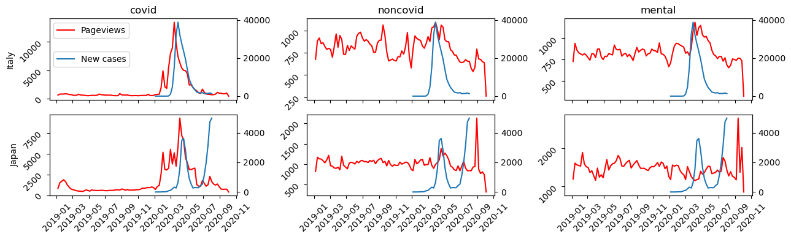
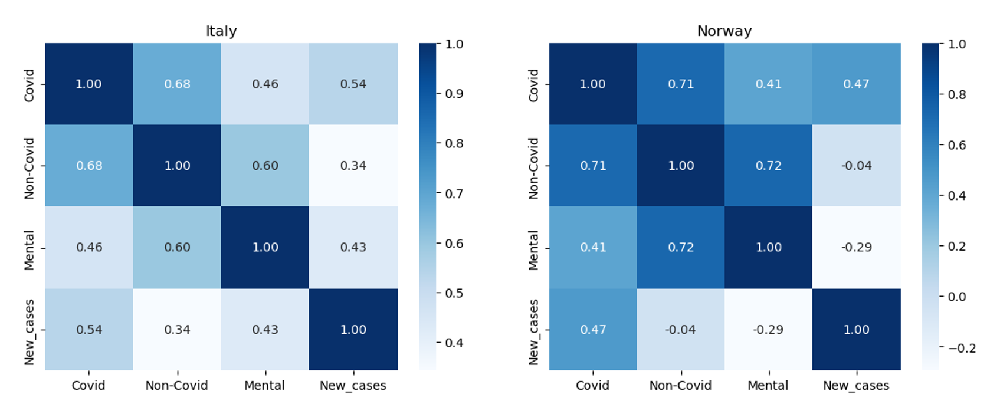
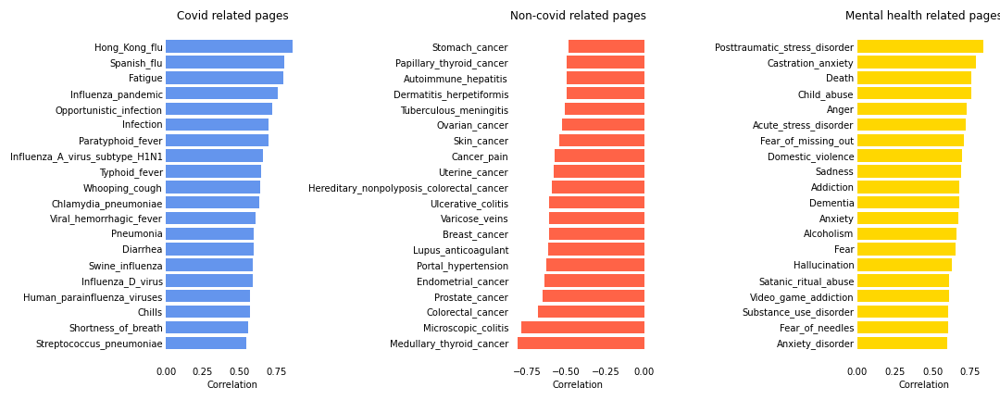

# A peek at covid's impact on physical and mental health through digital footprints



# Motivation
*“The world faces two major problems in 2020, the predicted climate change and the unexpected COVID-19 epidemic.”*

*“The Coronavirus Disease 2019 (COVID-19) pandemic is one of the most impactful crises that shook global economies, restricted social activities, emptied public spaces, infected 182 million people, and has taken more than 3.94 million lives from 213 countries (as of July 2021) since its outbreak in December of 2019.”*

COVID -19 has caused huge and important shifts in people’s lives due to the implementation of unprecedented non-pharmaceutical interventions, which in turn created challenges that did not only contain physical health but mental health as well. This fact has fostered an unforeseen effort to better identify how the pandemic extensively affects human needs and health concerns.  

Pageviews of Wikipedia, the world’s largest online encyclopedia, could reflect the major developments and shifts in people’s attention during the lifetime of this pandemic. It is critical to track the digital footprints above, which will empower governments to know what the public values thus better responding to potential public health emergencies in the future.

# Our data

# Goal
We want to know how and what people’s attention on health has changed during the different periods of the pandemic. Using the Coronawiki dataset, we obtain the pageviews of different topics related to health, which are then used to analyze their correlation with new COVID cases and the trends following mobility restrictions. 

# Research questions
1. Is there any evidence showing that the trend of pageviews associated with COVID-19 is related to COVID infections? If it does, what’s their causation?
2. How attention to mental illness has changed during the pandemic. Are these changes mainly due to social and psychological changes caused by the epidemic lockdown or due to people's panic about this new disease? 
3. Previously, people's concerns about the disease followed a fixed pattern, but the outbreak of COVID-19 may have changed that. How did these diseases such as cancer, which are not clearly associated with COVID-19, change during the pandemic? Are they related to changes in cases of COVID-19?

# The correlations between new covid cases and pageviews
Analyzing the pageviews of Wikipedia articles can give us an insight into how people are using them to share and find information during this unprecedented time. How can the spread of the diseases influence the pageview of Covid-related articles? Is it possible to use this trend to identify other diseases that might be brought by Covid? As mentioned previously, all the collected articles were divided into 3 groups manually, including Covid, non-Covid, and mental health. The figure below shows how the pageviews and new cases change over time for the 3 categories.   

It shows that there is a significant correlation between pageviews of COVID-19-related articles and new Covid cases in that country. Before the outbreak of Covid-19, people may be searching for information on Wikipedia only out of curiosity or concern, so the pageviews were low at that time. However, with the increasing number of new cases, more and more people were seeking updated and accurate information about the pandemic. The pandemic has had a significant impact on people's lives, and it is natural for people to want to learn more about it and how it is affecting the world. As for non-Covid, and mental health, the correlations seem to be insignificant. Especially for Japan, it can be concluded that there are no correlations for these 2 categories.  

To quantify the correlations, Spearman's rank correlation coefficients were calculated to assess how well the relationships among these variables. 2 examples were given in the following figures. 

It appears that for both Italy and Norway, Covid-related pageviews are relatively highly correlated with the trends of new cases with correlation coefficients around 0.5. As for non-Covid-related pageviews, the correlations are lower, which was what we expected because it should have nothing to do with the new pandemic. As for the mental health category, it seems to be case by case. The negative correlations can indicate that people are paying more attention to the disease itself, neglecting what they used to care about.  

Then, both Covid and mental health were divided into another 4 categories to investigate which area caught our eye. As for Covid-related articles, those about the pandemic are highly correlated with new cases in most countries, followed by articles about flu. Everything is a little bit different in South Korea. It might be caused by the fact that the most popular search engine in South Korea is Naver, and if you search for Covid-19 on Naver, Wikipedia will not appear on the first page.







# Correlation between mobility and pageviews


Correlation among different countries



