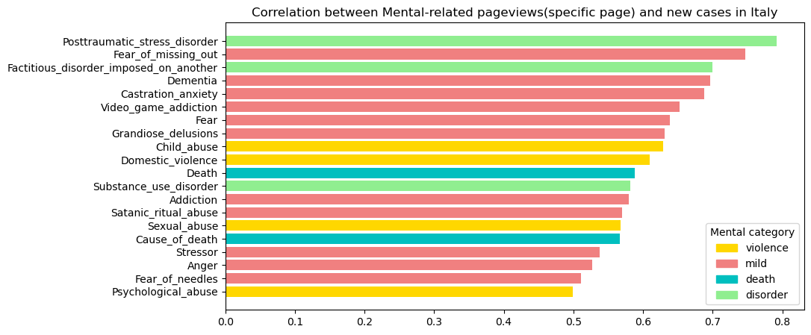
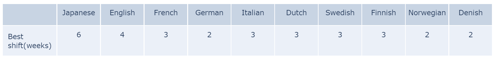

<!--  -->
<!-- # A peek at covid's impact on physical and mental health through digital footprints
<!--  -->
<!--  --> 
# Motivation
*“The world faces two major problems in 2020, the predicted climate change and the unexpected COVID-19 epidemic.”*

*“The Coronavirus Disease 2019 (COVID-19) pandemic is one of the most impactful crises that shook global economies, restricted social activities, emptied public spaces, infected 182 million people, and has taken more than 3.94 million lives from 213 countries (as of July 2021) since its outbreak in December of 2019.”*

COVID -19 has caused huge and important shifts in people’s lives due to the implementation of unprecedented non-pharmaceutical interventions, which in turn created challenges that did not only contain physical health but mental health as well. This fact has fostered an unforeseen effort to better identify how the pandemic extensively affects human needs and health concerns.  

Pageviews of **Wikipedia**, the world’s largest online encyclopedia, could reflect the major developments and shifts in people’s attention during the lifetime of this pandemic. It is critical to track the digital footprints above, which will empower governments to know what the public values thus better responding to potential public health emergencies in the future.

# Our data

Here are the datasets we got or collected:
 
- Mobility data from Google and Apple
- Covid cases data from WHO and Johns Hopkins University
- Pageviews from the Wiki dataset
 
You can find the complete data about this story here, and more detailed data for the begin of the journey can be found here. For a more detailed description of the data, you can refer to this article.

**Mobility** data describes the daily percentage change in people's time in different places, while Covid data collected tell us the daily new cases. For people's online life, we have selected a total of 544 different pages in 3 categories to analyse the change in the number of page views per day or per week.
 
The outbreak of Covid in most countries was in the spring of 2020, and we are interested in the mobility of people in the unusual year of 2020, the association of wiki page views with the outbreak, especially from January to October 2020, when Covid was more severe. As a comparison, we also collected data for the same time period in 2019 as a reference for a typical year. What's more, we also have the data discribing the public events of each area, such as the time of first case etc..
 
In total, we collected wiki pages in 13 different languages, corresponding to 24 different countries，which is shown in the figure below. Thanks to the fact that each entry in the wiki dataset has the same QID for different languages, we only need to identify the entries under the English category to collect all the data. Of course, not all entries will be present under all languages, so there will be a little difference between languages in our dataset. To correspond to the countries in the mobility dataset and Covid cases, we assign different countries according to the proportion of the population speaking different languages. The story we are telling is not about the U.S. and UK, but rather about English speaking countries, etc.
 


Which wiki pages to choose for analysis? In our story, we are concerned with three types of pages, which related to

- Physical diseases and symptoms related to Covid, such as fever, pneumonia, etc.
- Physical illnesses and symptoms not related to Covid, such as cancer, chronic diseases, etc.
- Mental health-related diseases and symptoms, such as anxiety, depression, etc.
 
Health problems related to Covid are a complex topic, and we would like to make a classification here as simple as possible to facilitate further analysis. We relate the impact of Covid on each individual's physical and mental health, etc. Physical health can be divided into those directly related to Covid and those unrelated to Covid. Within each of these broad categories, we further categorised the words according to their nature to obtain more detailed characteristics. By clicking on the pie chart above, more detailed Description("**Dsp**") will be provided. 

Here we show an overview of how the pageviews change over time. 

# Goal
We want to know how and what people’s attention on health has changed during the different periods of the pandemic. Using the Coronawiki dataset, we obtain the pageviews of different topics related to health, which are then used to analyze their correlation with new COVID cases and the trends following mobility restrictions. 

# Research questions
1. Is there any evidence showing that the trend of pageviews associated with COVID-19 is related to COVID infections? If it does, what’s their causation?
2. The stringent policies implemented during the Coronavirus pandemic had reduced human movements. We wonder if there is a correlation between the Wiki pageviews and mobility change? If it does, what’s their causality and what can we infer from the data?
3. How attention to mental illness has changed during the pandemic. 

# The correlations between new covid cases and pageviews
Analyzing the pageviews of Wikipedia articles can give us an insight into how people are using them to share and find information during this unprecedented time. How can the spread of the diseases influence the pageview of Covid-related articles? Is it possible to use this trend to identify other diseases that might be brought by Covid? As mentioned previously, all the collected articles were divided into 3 groups manually, including Covid, non-Covid, and mental health. The figure below shows how the pageviews and new cases change over time for the 3 categories.   

It shows that there is a significant correlation between pageviews of COVID-19-related articles and new Covid cases in that country. Before the outbreak of Covid-19, people may be searching for information on Wikipedia only out of curiosity or concern, so the pageviews were low at that time. However, with the increasing number of new cases, more and more people were seeking updated and accurate information about the pandemic. The pandemic has had a significant impact on people's lives, and it is natural for people to want to learn more about it and how it is affecting the world. As for non-Covid, and mental health, the correlations seem to be insignificant. Especially for Japan, it can be concluded that there are no correlations for these 2 categories.  

To quantify the correlations, Spearman's rank correlation coefficients were calculated to assess how well the relationships among these variables. 2 examples were given in the following figures. 

It appears that for both Italy and Norway, Covid-related pageviews are relatively highly correlated with the trends of new cases with correlation coefficients around 0.5. As for non-Covid-related pageviews, the correlations are lower, which was what we expected because it should have nothing to do with the new pandemic. As for the mental health category, it seems to be case by case. The negative correlations can indicate that people are paying more attention to the disease itself, neglecting what they used to care about.  

Then, both Covid and mental health were divided into another 4 categories to investigate which area caught our eye. As for Covid-related articles, those about the pandemic are highly correlated with new cases in most countries, followed by articles about flu. When Covid came, people wanted to know more about other similar pandemics and outbreaks of infectious diseases, which can help them better understand the factors that contribute to the spread of infectious diseases, as well as the strategies that have been successful in controlling and mitigating their impact. Additionally, studying past pandemics can provide valuable insights and lessons for responding to current and future health crises, such as the ongoing Covid-19 pandemic. Since some symptoms of Covid-19 are similar as flu, people searched more about flu as well.

Everything is a little bit different in South Korea. It might be caused by the fact that the most popular search engine in South Korea is Naver, and if you search for Covid-19 on Naver, Wikipedia will not appear on the first page.



When it comes to mental health, we found out that the correlation coefficients are low for most countries, among which Italy has the highest. In the figure, the top 3 countries were displayed. As the results show, with the development of Covid-19, Italian was struggling more with mild symptoms including stress, fear, anxiety, and PTSD, but also violence which can be brought by their families since they are forced to live together for a longer time due to quarantine. The increasing stress and uncertainty lead them to seek information about how to cope with these feelings and manage their mental health especially for those with only mild symptoms. In addition, some people may be more comfortable seeking information about mental health online because they can do so anonymously. This can be especially important for those who are reluctant to seek help due to stigma or fear of discrimination.



# The correlation between mobility change and pageviews

Now, let’s focus on the relationship between mobility change and pageviews. During 2020, many countries declared a state of emergency and implemented mobility restrictions, including stay-at-home lockdowns, cancellation of events and public gatherings, and restrictions on travels. These policies helped to slow the spread of the virus, but also brought side effects to people’s mental health. Are people more concerned about their physical health or mental health during lockdown? In order to answer this question, we introduce **Google Mobility Reports**. By using the similar analysis method as above, we could have a deeper understanding of the relationship between people’s attention shift and their movement change.

As we can see from the figure below, there is clear relation between pageviews and mobility change in Italy. Unlike the new covid cases, we observe something special here, which is a parallel shift among covid related pageviews and mobility. On the other hand, we can not observe similar result in the non-covid and mental cases. This phenomenon drew our attention, we wonder if other countries share the same situation or not, and what would be the best shift that gives the highest correlation. 

Bearing this in mind, we do the correlation analysis between covid related pageviews and mobility change, and find the best shift for each country. Taking Italy as an example, if you dragging the button below, you would find the best shift for Italy is 3 weeks.


The same shift property applies to other countries as well, as you can see from the table. We observe that Asian country (Japan) has the largest shift, and for European country the shifts are all between 2-3 weeks. What might cause the delay? Intuitively, we know it takes times for people to take actions after searching for the covid situation on Internet, there is a reaction time. On the other hand, we can regard mobility change as a result of the government policy implementation, people change their mobility because policies required them to leave public places and stay at home. From this perspective, it can be inferred from the results that the average virus transmission and restrictions implementation time in Europe is around 3 weeks. After people aware of the covid situation, it took about 3 weeks for the policies to be implemented. The situation was slightly different in Japan, our conjecture is: virus spreads more slowly in Japan in early 2020 and the mobility-related measures were also weaker compare with other countries.

Then, we are curious about the correlation between each category (covid, non-covid, mental) and mobility change across countries. In order to eliminate the impact of action delay, we use the pageviews data after shift and compute its correlation with mobility. As we can see from the image, covid-related pageviews has a significant positive relation with mobility change, but the correlation of non-covid and mental pageviews is more dispersed and less significant, even though the correlation is still positive in most countries. This means people have relevtively consistent behaviors when searching for covid-related pages, but regarding non-covid pages and mental pages, their behavior differ in the country level. 


A further interesting causal question would be what people are searching when mobility constraints are implemented. In order to answer this question, we focus on more granular pages, and calculate their relation between mobility. Here, we show the top 20 largest for covid and mental related pages, and top 20 smallest for non-covid related pages. 

For covid category, we find that pandemic and flu related pages has the highest correlation, potential explanation is people searching for past pandemics and trying to find similarities (such as Hong Kong flu in 1968 and Spanish flu in 1918), they are also engaging in searching covid related symptoms (such as fatigue and fever). As for mental health, the click on anxiety, death and violence are highly related to mobility change, which could help support the analysis that social distancing increase people’s worries and anxiety about COVID-19. Lastly, if we look at the non-covid related pages, we can see a decrease in the cancer related pages, which reflects a shift in attention from cancer to covid symptoms.

# Change points' impacts

With the **intervention** data, we have the time for each event like first covid case, lockdown and so on. Here we want to show how these events affect people's internet behavior and how big that effect is. 



From previous studies, the wiki pages related to covid have the strongest correlation with the reality of covid. Here, we applied the breakpoint regression of covid-related page traffic under different events and found that attention for covid-related pages peaked at moments when the government took severe social isolation measures (e.g., school closures, lockdown declarations). After that,  people's attention to covid-related pages dropped significantly after these events. The emergence of the first infection rate and the first death case significantly increased the attention to covid-related information.

 

 On the other hand, the analysis of mental health is not exactly the same. Because of the emergence of covid, the attention to mental health-related pages is significantly different from that in 2019. It is gradually increasing as the dissemination time of covid increases. But when significant events related to covid occur, there is a significant decrease in attention to mental health, which may due to the sudden attention to covid have led to the neglect of mental health.

 

The image above shows how people's attention to all wiki topics has changed at the point where people's mobility has changed(**Mobility**). The previous results for covid and mental health remain the same, while for non-covid disorders, there is a very significant change at the mobility change point. The main effect is mainly on chronic diseases. Such results suggest that covid is causing a medical shortage and that measures to restrict mobility significantly impact those who need to take medication for a long time.

We compare the impact of different countries on the covid topic in the figure below, and the chosen event is still the point at which people's mobility changes. There are significant differences in behaviour patterns across countries and regions. Feel free to play with this figure!

 

# Conclusion

1. From the pageviews analysis, we know that government have delay reactions when facing with COVID-19, and the implementation of policies generally take several weeks. We also observe that when people are forced to stay at home, they search more on covid-related pages, especially those related pandemic and physical health. Besides, restrict movement measures damage people’s mental health, they are searching on Wikipedia to relief anxiety and depression. 
2. People in different countries and regions react differently to covid. Despite increasing concern about covid, people do not seem to be surprised by the blockade, which has had less impact than the discovery of the first infected patient in their region. Covid has also led to increased mental health needs, but this needs to be given more attention by society when making decisions. Restrictions on mobility may significantly impact people with other diseases requiring long-term medication, and policymakers must consider this when developing policies.

# One last word
Thanks to the ADA course for providing us with the original ideas and datasets, although the epidemic is now a thing of the past, we hope we could understand the impact of the COVID-19 on people's behavior through data analysis methods. Some of the research methods in this website are referenced from [Sudden Attention Shifts on Wikipedia During the COVID-19 Crisis](https://arxiv.org/pdf/2005.08505.pdf) and [Population-scale dietary interests during the COVID-19 pandemic](https://www.nature.com/articles/s41467-022-28498-z), which are two amazing papers!

# Our team
