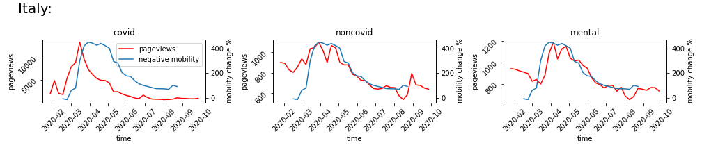

# A peek at covid's impact on physical and mental health through digital footprints



# Motivation
*“The world faces two major problems in 2020, the predicted climate change and the unexpected COVID-19 epidemic.”*

*“The Coronavirus Disease 2019 (COVID-19) pandemic is one of the most impactful crises that shook global economies, restricted social activities, emptied public spaces, infected 182 million people, and has taken more than 3.94 million lives from 213 countries (as of July 2021) since its outbreak in December of 2019.”*

COVID -19 has caused huge and important shifts in people’s lives due to the implementation of unprecedented non-pharmaceutical interventions, which in turn created challenges that did not only contain physical health but mental health as well. This fact has fostered an unforeseen effort to better identify how the pandemic extensively affects human needs and health concerns.  

Pageviews of Wikipedia, the world’s largest online encyclopedia, could reflect the major developments and shifts in people’s attention during the lifetime of this pandemic. It is critical to track the digital footprints above, which will empower governments to know what the public values thus better responding to potential public health emergencies in the future.

# Our data

# Goal
We want to know how and what people’s attention on health has changed during the different periods of the pandemic. Using the Coronawiki dataset, we obtain the pageviews of different topics related to health, which are then used to analyze their correlation with new COVID cases and the trends following mobility restrictions. 

# Research questions
1. Is there any evidence showing that the trend of pageviews associated with COVID-19 is related to COVID infections? If it does, what’s their causation?
2. How attention to mental illness has changed during the pandemic. Are these changes mainly due to social and psychological changes caused by the epidemic lockdown or due to people's panic about this new disease? 
3. Previously, people's concerns about the disease followed a fixed pattern, but the outbreak of COVID-19 may have changed that. How did these diseases such as cancer, which are not clearly associated with COVID-19, change during the pandemic? Are they related to changes in cases of COVID-19?

# The correlations between new covid cases and pageviews
Analyzing the pageviews of Wikipedia articles can give us an insight into how people are using them to share and find information during this unprecedented time. How can the spread of the diseases influence the pageview of Covid-related articles? Is it possible to use this trend to identify other diseases that might be brought by Covid? As mentioned previously, all the collected articles were divided into 3 groups manually, including Covid, non-Covid, and mental health. The figure below shows how the pageviews and new cases change over time for the 3 categories.   

It shows that there is a significant correlation between pageviews of COVID-19-related articles and new Covid cases in that country. Before the outbreak of Covid-19, people may be searching for information on Wikipedia only out of curiosity or concern, so the pageviews were low at that time. However, with the increasing number of new cases, more and more people were seeking updated and accurate information about the pandemic. The pandemic has had a significant impact on people's lives, and it is natural for people to want to learn more about it and how it is affecting the world. As for non-Covid, and mental health, the correlations seem to be insignificant. Especially for Japan, it can be concluded that there are no correlations for these 2 categories.  

To quantify the correlations, Spearman's rank correlation coefficients were calculated to assess how well the relationships among these variables. 2 examples were given in the following figures. 

It appears that for both Italy and Norway, Covid-related pageviews are relatively highly correlated with the trends of new cases with correlation coefficients around 0.5. As for non-Covid-related pageviews, the correlations are lower, which was what we expected because it should have nothing to do with the new pandemic. As for the mental health category, it seems to be case by case. The negative correlations can indicate that people are paying more attention to the disease itself, neglecting what they used to care about.  

Then, both Covid and mental health were divided into another 4 categories to investigate which area caught our eye. As for Covid-related articles, those about the pandemic are highly correlated with new cases in most countries, followed by articles about flu. When Covid came, people wanted to know more about other similar pandemics and outbreaks of infectious diseases, which can help them better understand the factors that contribute to the spread of infectious diseases, as well as the strategies that have been successful in controlling and mitigating their impact. Additionally, studying past pandemics can provide valuable insights and lessons for responding to current and future health crises, such as the ongoing Covid-19 pandemic. Since the some symptoms of Covid-19 are similar as flu, people searched more about flu as well. 

Everything is a little bit different in South Korea. It might be caused by the fact that the most popular search engine in South Korea is Naver, and if you search for Covid-19 on Naver, Wikipedia will not appear on the first page.



When it comes to mental health, we found out that the correlation coefficients are low for most countries, among which Italy has the highest. In the figure, the top 3 countries were displayed. As the results show, with the development of Covid-19, Italian was struggling more with mild symptoms including stress, and anxiety, and also violence which may be brought by their families. The increasing stress and uncertainty lead them to seek information about how to cope with these feelings and manage their mental health especially for those with only mild symptoms. In addition, some people may be more comfortable seeking information about mental health online because they can do so anonymously. This can be especially important for those who are reluctant to seek help due to stigma or fear of discrimination.



# Correlation between mobility and pageviews

Now, let’s focus on the relationship between mobility change and pageviews. During 2020, many countries declared a state of emergency and implemented mobility restrictions, including the closure of entertainment venues and home isolation. We want to know how people’s attention to different topics related to their movement trend or the government policy. 

As we can see from the figure below, there is clear relation between pageviews and mobility change in Italy. Unlike the previous analysis between new covid case and pageviews, we observe something special here, which is a parallel shift among covid related pageviews and mobility. On the other hand, it does not show in the non-covid and mental cases. This phenomenon drew our attention, we wonder if other countries share the same situation and what would be the best shift that gives the highest correlation. 

Bearing this in mind, we do the correlation analysis between covid related pageviews and mobility change, and find the best shift for each country. Take Italy as an example, if you dragging the button below, you would find the best shift for Italy is 3 weeks.


The same shift property applies to other countries as well, as you can see from the table below. We can observe that Asian country (Japan) has the largest shift, and for European country the shifts are all between 2-3 weeks. What might cause the delay? Intuitively, it does take some time for people to take actions after knowing the covid situation from Internet. On the other hand, the mobility change is a reflection of government policy implementation, people are recommended or forced to leave public places and stay at home. It can be inferred from the results that it took on average 3 weeks for virus transmission and restrictions implementation in Europe. The situation was slightly different in Japan, our conjecture is: covid spreads more slowly in Japan and the mobility-related measures were weaker compare with other countries.

Then, we want to know the correlation between each category (covid, non-covid, mental) and mobility change across countries. In order to eliminate the impact of action delay, we use the pageviews data after shift and compute its correlation with mobility. As we can see from the image, covid-related pageviews has a significant positive relation with mobility change, but the correlation of non-covid and mental pageviews is more dispersed and less significant. 


A further interesting causal question would be what people are searching when mobility constraints are implemented. In order to answer this question, we focus on more granular pages, and calculate their relation between mobility. Here, we show the top 20 largest for covid and mental related pages, and top 20 smallest for non-covid related pages. 

For covid category, we find that pandemic and flu related pages has the highest correlation, potential explanation is people searching for past pandemics and trying to find similarities (such as Hong Kong flu in 1968 and Spanish flu in 1918), they are also engaging in covid related symptoms (such as fatigue and fever). As for mental health, the click on anxiety, death and violence are highly related to mobility change, which could help support the analysis that social distancing increase people’s worries and anxiety about COVID-19. Lastly, if we look at the non-covid related pages, we can see a decrease in the cancer related pages, which reflects a shift in attention from cancer to covid symptoms. 

# Conclusion

# Reference

# Our team
